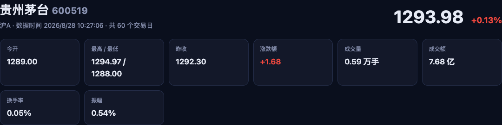
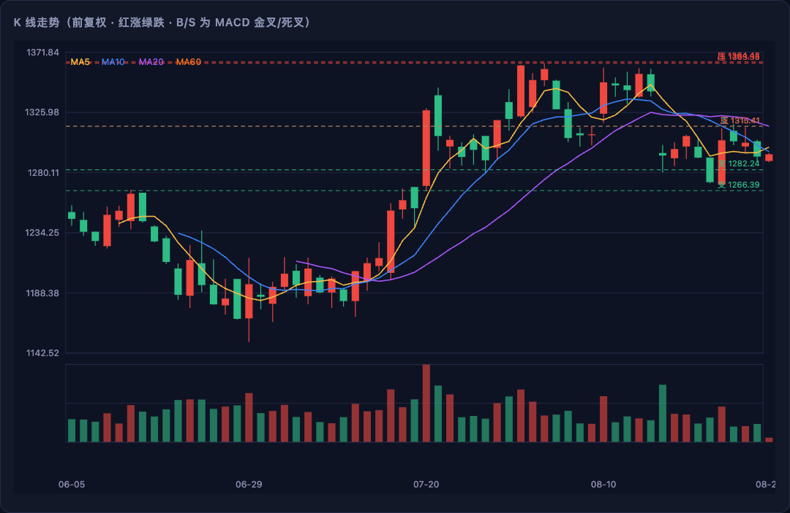
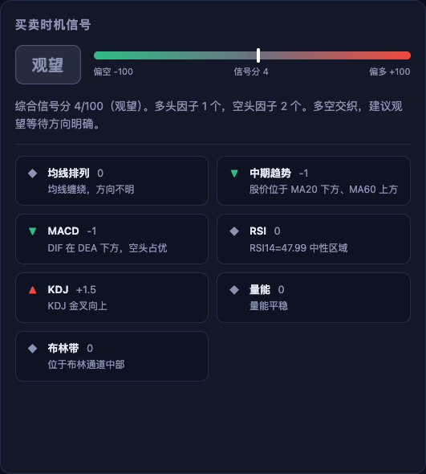
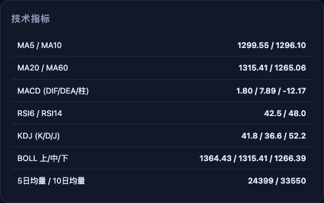
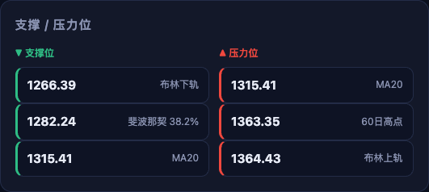
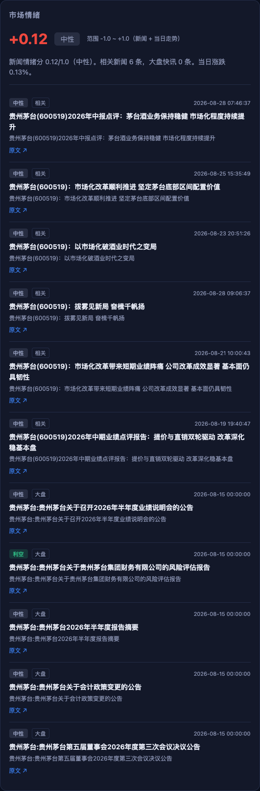
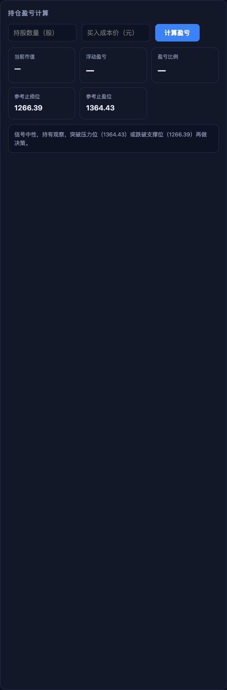
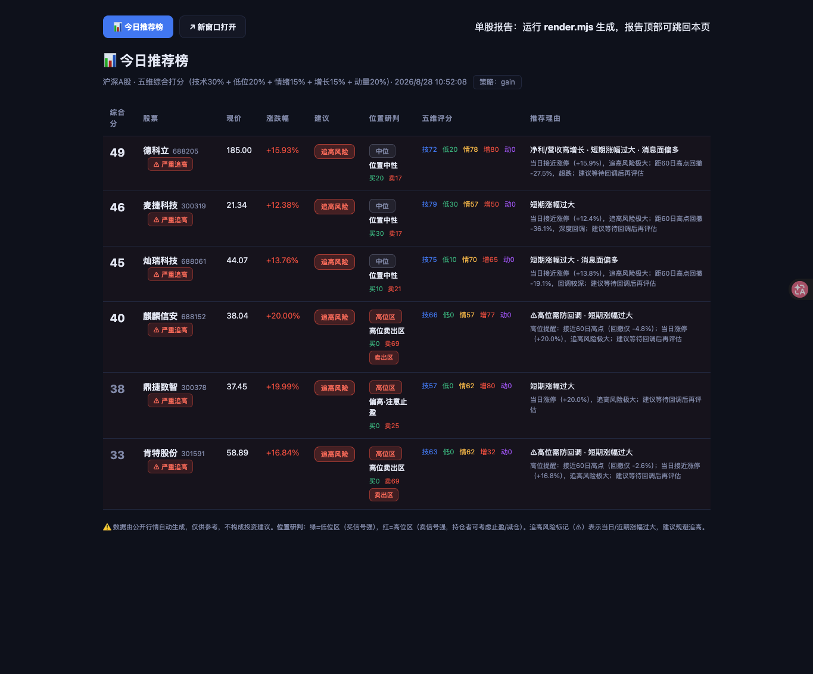
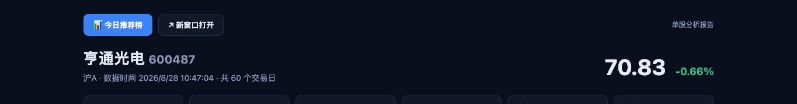
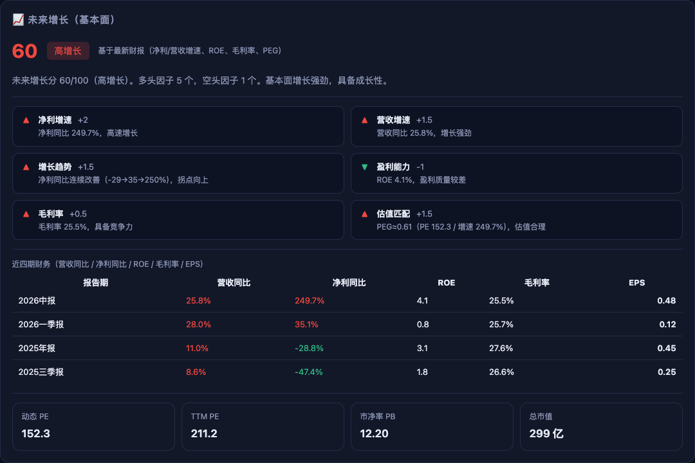

# 📈 dsh-stock-analysis

> A 股股票分析与买卖时机研判技能 —— 让 AI Agent 在对话中直接给出 **K 线图 + 关键新闻 + 市场情绪 + 买卖时机 + 持仓盈亏** 的一站式分析。

## 🖼️ 效果展示（贵州茅台 600519 · 实盘数据）

完整报告生成后，Agent 会把**关键结论**逐模块呈现给用户。以下为真实运行截图：

### 1️⃣ 头部概览

股票名称、代码、实时现价与涨跌幅，以及今开、最高/最低、昨收、涨跌额、成交量、成交额、换手率、振幅 8 项行情指标。



### 2️⃣ K 线走势

前复权日 K 线图：红涨绿跌，叠加 MA5 / MA10 / MA20 / MA60 均线、布林带与成交量，B/S 标注 MACD 金叉/死叉。



### 3️⃣ 买卖时机信号

核心结论：综合信号分（0-100）、多空因子统计、最终建议（观望 / 买入 / 卖出），以及每个因子的具体贡献。



### 4️⃣ 技术指标

MA5/10/20/60、MACD（DIF/DEA/柱）、RSI6/14、KDJ、BOLL 等指标的当前具体数值。



### 5️⃣ 支撑 / 压力位

布林带下轨/上轨、斐波那契回撤、均线等关键支撑位与压力位自动标注，供设置止损/止盈参考。



### 6️⃣ 市场情绪

新闻情绪分（-1.0 ~ +1.0）、相关新闻列表、当日走势与大盘快讯，量化市场对这只股票的整体态度。



### 7️⃣ 持仓盈亏计算

交互式计算器：输入股数与买入成本价即可计算当前市值、浮动盈亏金额与比例，并给出参考止损/止盈位。



### 8️⃣ 今日推荐榜（多维度选股）

从沪深 A 股榜单筛选候选，按 **技术30% + 低位20% + 情绪15% + 增长15% + 动量20%** 五维综合打分排序。**动量维度对当日涨停/大涨与近期涨幅过大做重罚**（涨停直接标记「追高风险」），避免追高推荐。支持 `--strategy gain|amount|volume|turnover` 切换选股池，并生成可独立打开的推荐榜页面。



> 推荐榜与单股报告均可**独立新 tab 打开**：单股报告顶部导航条含「📊 今日推荐榜」按钮（点击在新 tab 打开推荐榜页面），推荐榜页也可新窗口打开。



### 9️⃣ 未来增长（基本面）区块

单股报告新增「未来增长」区块：净利/营收同比、增长趋势、ROE、毛利率、PEG 估值匹配多维打分，并列出近四期财务数据。



## ✨ 功能特性

- 🕐 **实时行情 + 日K线**：抓取 A 股实时报价与前复权日 K（东方财富公开接口，免费、无需 key）
- 📰 **相关新闻 + 市场情绪**：7x24 快讯按股票过滤，计算新闻情绪分
- 🎯 **多因子买卖信号**：均线、MACD、RSI、KDJ、量能、布林带 6 因子打分，输出信号分与关键因子
- 📉 **支撑/压力位**：布林带、斐波那契、均线自动标注
- 💰 **持仓盈亏计算**：输入「股数 + 成本价」即算浮盈/浮亏金额与比例，并给出参考止损/止盈位
- 📊 **可视化交付**：内嵌 SVG K 线图 + 完整 HTML 报告（含交互式盈亏计算器）
- 📈 **未来增长评分**：净利/营收同比 + 增长趋势 + ROE + 毛利率 + PEG 基本面多维打分
- 🎯 **多维度选股推荐**：按「技术30% + 低位20% + 情绪15% + 增长15% + 动量20%」五维综合打分排序，动量维度重罚涨停/大涨追高，输出今日推荐榜

## 🚀 快速开始

### 环境要求

- Node.js 18+（原生 fetch，**零第三方依赖**）

### 安装为 DSH 技能

```bash
# 1. 克隆到本地技能目录
git clone https://github.com/ailuo8899/dsh-stock-analysis.git ~/.dsh/skills/dsh-stock-analysis

# 2. 重启 DSH 会话，即可自动触发（无需配置）
```

### 手动命令行使用

```bash
# 1. 抓取数据（约 3-5 秒）
node scripts/fetch.mjs 600519 --days 120 --out stock-data.json

# 2. 技术分析 + 信号 + 情绪 + 盈亏（--shares/--cost 可选）
node scripts/analyze.mjs stock-data.json --shares 100 --cost 1500 --out result.json

# 3. 渲染 K 线图与 HTML 报告
node scripts/render.mjs stock-data.json result.json --out report.html --svg chart.svg --summary

# 4. 多维度选股推荐（今日推荐榜）
node scripts/screen.mjs --top 10 --days 60 --out screen.json
```

`--summary` 直接输出可粘贴到对话的 markdown 摘要（已含内嵌 SVG K 线图）。

### 选股推荐（screen.mjs）

从沪深榜单筛选候选，逐只抓取行情/新闻/基本面，按 **五维综合打分** 排序输出推荐榜：

| 维度 | 权重 | 计算依据 |
|---|---|---|
| 技术面 | 30% | 均线、MACD、RSI、KDJ、量能、布林 6 因子信号分 |
| 低位买入信号 | 20% | 距60日高点回撤、区间位置、布林下轨/RSI超卖、低位放量 |
| 情绪面 | 15% | 新闻情绪分（利好/利空） |
| 未来增长 | 15% | 净利/营收同比、增长趋势、ROE、毛利率、PEG |
| **动量（追高风险）** | 20% | 当日涨幅 + 5/10日涨幅；涨停/接近涨停重罚并强制标记「追高风险」 |

**双向交易视角**：位置分析同时输出 **低位买入信号** 与 **高位卖出信号**——

- **低位买入视角**（推荐榜主排序）：买' + '分高 = 回撤深/区间低位/超卖/布林下轨/低位放量 → 「低位区·可低吸」
- **高位卖出视角**（持仓者止盈/减仓）：卖' + '分高 = 区间高位/超买/接近高点/高位放量滞涨/放量下跌 → 单独列出「高位卖出提醒」，提示止盈减仓

控制台与 HTML 推荐榜均分两段输出：**今日推荐（低位买入视角）** + **高位卖出提醒（持仓者参考）**。

**策略切换**：`--strategy gain`（涨幅榜，默认）/ `amount`（成交额榜）/ `volume`（成交量榜）/ `turnover`（换手率榜）。
**HTML 推荐榜**：`--html screen-board.html` 生成可独立打开的推荐榜页面；单股报告顶部导航条含「📊 今日推荐榜」按钮（新 tab 打开）。

可选参数：`--min-price` / `--max-price` 过滤价格区间。

## 🔄 工作流

1. **识别股票与持仓**：从用户消息提取股票代码/名称，以及可选的「股数 + 成本价」
2. **抓取数据**：`fetch.mjs` 抓取实时行情、日K线、相关新闻、基本面财务、估值
3. **技术分析**：`analyze.mjs` 计算 6 因子信号、情绪分、未来增长分、支撑压力位、持仓盈亏
4. **渲染交付**：`render.mjs` 生成 SVG K 线图 + HTML 报告（含未来增长区块）+ markdown 摘要
5. **选股推荐**：`screen.mjs` 五维综合打分排序（含动量追高惩罚），输出今日推荐榜
6. **回复用户**：粘贴摘要（含 K 线图）、给出 HTML 报告路径、讲清持仓盈亏与推荐理由

## 📁 文件结构

```
dsh-stock-analysis/
├── SKILL.md            # 技能定义（DSH 自动加载）
├── scripts/
│   ├── fetch.mjs       # 数据抓取：行情 / K线 / 新闻 / 基本面 / 估值
│   ├── analyze.mjs     # 技术指标 + 多因子信号 + 情绪 + 未来增长 + 盈亏
│   ├── render.mjs      # SVG K线图 + HTML 报告（含增长区块）+ markdown 摘要
│   └── screen.mjs      # 五维选股推荐（技术+低位+情绪+增长+动量，含追高惩罚）
└── assets/
    ├── screenshot-1-header.png         # 头部概览（现价 + 8 项行情指标）
    ├── screenshot-2-kline.png          # K 线走势（均线 + 布林带 + 成交量）
    ├── screenshot-3-signal.png         # 买卖时机信号（信号分 + 多空因子）
    ├── screenshot-4-indicators.png     # 技术指标（MA / MACD / RSI / KDJ / BOLL）
    ├── screenshot-5-support-resistance.png # 支撑 / 压力位
    ├── screenshot-6-sentiment.png      # 市场情绪（新闻情绪分 + 相关新闻）
    ├── screenshot-7-pnl.png            # 持仓盈亏计算（交互式计算器）
    ├── delike-signal.png               # 推荐股买卖时机信号（买入）
    ├── delike-growth.png               # 未来增长（基本面）区块
    ├── screen-board.png                # 今日推荐榜（五维打分排序 + 追高标记）
    ├── navbar-screenshot.png           # 报告顶部导航条（可新 tab 打开推荐榜）
    ├── example-screen-board.html       # 示例推荐榜页面（可独立打开）
    └── example-report.html             # 完整示例 HTML 报告
```

## 📝 示例输出

完整示例报告见 [assets/example-report.html](assets/example-report.html)（含完整 K 线图、技术指标表、交互式盈亏计算器）。

## ⚠️ 说明

- 数据源为东方财富公开接口（免费、无需 key）；盘中数据延迟约数十秒，收盘后为当日最终数据
- 支持格式：6 位代码（600519）、sh/sz 前缀（sh600519）、中文名称（贵州茅台）
- 港股/美股暂不支持（架构已预留）
- 新闻为 7x24 快讯过滤，若当天无直接相关新闻会显示大盘快讯并标注

## 📄 免责声明

**分析仅供参考，不构成投资建议。** 股市有风险，投资需谨慎。
