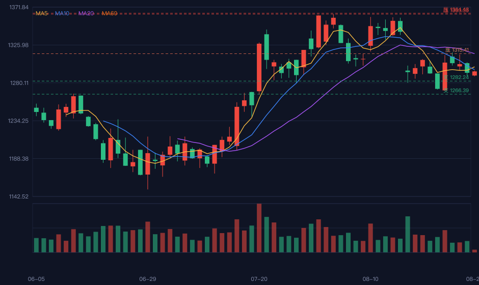

# 📈 dsh-stock-analysis

> A 股股票分析与买卖时机研判技能 —— 让 AI Agent 在对话中直接给出 **K 线图 + 关键新闻 + 市场情绪 + 买卖时机 + 持仓盈亏** 的一站式分析。



## ✨ 功能特性

- 🕐 **实时行情 + 日K线**：抓取 A 股实时报价与前复权日 K（东方财富公开接口，免费、无需 key）
- 📰 **相关新闻 + 市场情绪**：7x24 快讯按股票过滤，计算新闻情绪分
- 🎯 **多因子买卖信号**：均线、MACD、RSI、KDJ、量能、布林带 6 因子打分，输出信号分与关键因子
- 📉 **支撑/压力位**：布林带、斐波那契、均线自动标注
- 💰 **持仓盈亏计算**：输入「股数 + 成本价」即算浮盈/浮亏金额与比例，并给出参考止损/止盈位
- 📊 **可视化交付**：内嵌 SVG K 线图 + 完整 HTML 报告（含交互式盈亏计算器）

## 🚀 快速开始

### 环境要求

- Node.js 18+（原生 fetch，**零第三方依赖**）

### 安装为 DSH 技能

```bash
# 1. 克隆到本地技能目录
git clone https://github.com/ailuo8899/dsh-stock-analysis.git ~/.dsh/skills/dsh-stock-analysis

# 2. 重启 DSH 会话，即可自动触发（无需配置）
```

### 手动命令行使用

```bash
# 1. 抓取数据（约 3-5 秒）
node scripts/fetch.mjs 600519 --days 120 --out stock-data.json

# 2. 技术分析 + 信号 + 情绪 + 盈亏（--shares/--cost 可选）
node scripts/analyze.mjs stock-data.json --shares 100 --cost 1500 --out result.json

# 3. 渲染 K 线图与 HTML 报告
node scripts/render.mjs stock-data.json result.json --out report.html --svg chart.svg --summary
```

`--summary` 直接输出可粘贴到对话的 markdown 摘要（已含内嵌 SVG K 线图）。

## 🔄 工作流

1. **识别股票与持仓**：从用户消息提取股票代码/名称，以及可选的「股数 + 成本价」
2. **抓取数据**：`fetch.mjs` 抓取实时行情、日K线、相关新闻
3. **技术分析**：`analyze.mjs` 计算 6 因子信号、情绪分、支撑压力位、持仓盈亏
4. **渲染交付**：`render.mjs` 生成 SVG K 线图 + HTML 报告 + markdown 摘要
5. **回复用户**：粘贴摘要（含 K 线图）、给出 HTML 报告路径、讲清持仓盈亏

## 📁 文件结构

```
dsh-stock-analysis/
├── SKILL.md            # 技能定义（DSH 自动加载）
├── scripts/
│   ├── fetch.mjs       # 数据抓取：行情 / K线 / 新闻
│   ├── analyze.mjs     # 技术指标 + 多因子信号 + 情绪 + 盈亏
│   └── render.mjs      # SVG K线图 + HTML 报告 + markdown 摘要
└── assets/
    ├── kline-screenshot.png   # 示例 K 线截图
    └── example-report.html    # 示例 HTML 报告
```

## 📝 示例输出

完整示例报告见 [assets/example-report.html](assets/example-report.html)（含完整 K 线图、技术指标表、交互式盈亏计算器）。

## ⚠️ 说明

- 数据源为东方财富公开接口（免费、无需 key）；盘中数据延迟约数十秒，收盘后为当日最终数据
- 支持格式：6 位代码（600519）、sh/sz 前缀（sh600519）、中文名称（贵州茅台）
- 港股/美股暂不支持（架构已预留）
- 新闻为 7x24 快讯过滤，若当天无直接相关新闻会显示大盘快讯并标注

## 📄 免责声明

**分析仅供参考，不构成投资建议。** 股市有风险，投资需谨慎。
